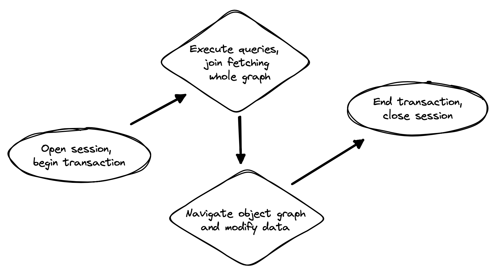

출처 : https://docs.jboss.org/hibernate/orm/6.4/introduction/html_single/Hibernate_Introduction.html#association-fetching


### 5.6. Proxies and lazy fetching
Our data model is a set of interconnected entities, and in Java our whole dataset would be represented as an enormous interconnected graph of objects. It’s possible that this graph is disconnected, but more likely it’s connected, or composed of a relatively small number of connected subgraphs.

Therefore, when we retrieve on object belonging to this graph from the database and instantiate it in memory, we simply can’t recursively retrieve and instantiate all its associated entities. Quite aside from the waste of memory on the VM side, this process would involve a huge number of round trips to the database server, or a massive multidimensional cartesian product of tables, or both. Instead, we’re forced to cut the graph somewhere.

Hibernate solves this problem using proxies and lazy fetching. A proxy is an object that masquerades as a real entity or collection, but doesn’t actually hold any state, because that state has not yet been fetched from the database. When you call a method of the proxy, Hibernate will detect the call and fetch the state from the database before allowing the invocation to proceed to the real entity object or collection.

> Now for the gotchas:
>
> 1. Hibernate will only do this for an entity which is currently associated with a persistence context. Once the session ends, and the persistence context is cleaned up, the proxy is no longer fetchable, and instead its methods throw the hated LazyInitializationException.
> 
> 
> 2. A round trip to the database to fetch the state of a single entity instance is just about the least efficient way to access data. It almost inevitably leads to the infamous `N+1 `selects problem we’ll discuss later when we talk about how to optimize association fetching.

---

### 7.3. Association fetching
Achieving high performance in ORM means minimizing the number of round trips to the database. This goal should be uppermost in your mind whenever you’re writing data access code with Hibernate. The most fundamental rule of thumb in ORM is:

explicitly specify all the data you’re going to need right at the start of a session/transaction, and fetch it immediately in one or two queries,

and only then start navigating associations between persistent entities.



Without question, the most common cause of poorly-performing data access code in Java programs is the problem of N+1 selects. Here, a list of N rows is retrieved from the database in an initial query, and then associated instances of a related entity are fetched using N subsequent queries.


In this section we’re going to discuss different ways to avoid such "chatty" interaction with the database.

Hibernate provides several strategies for efficiently fetching associations and avoiding N+1 selects:

- _**outer join fetching**_—where an association is fetched using a left outer join,

- _**batch fetching**_—where an association is fetched using a subsequent select with a batch of primary keys, and

- _**subselect fetching**_—where an association is fetched using a subsequent select with keys re-queried in a subselect.

Of these, you should almost always use outer join fetching. But let’s consider the alternatives first.

---


### `FetchType.LAZY` 주의해야 할 점들

1. 하이버네이트는 현재 영속성 컨텍스트와 연결된 엔티티에 대해서만 이 작업을 수행합니다. 세션이 종료되고 영속성 컨텍스트가 정리되면, 프록시는 더 이상 로딩할 수 없게 되고, 대신 그 메서드들은 악명 높은 LazyInitializationException을 발생시킵니다.
2. 단일 엔티티 인스턴스의 상태를 가져오기 위해 데이터베이스로 왕복하는 것은 데이터에 접근하는 가장 비효율적인 방법입니다. 이는 거의 inevitably 나중에 연관 관계 로딩을 최적화하는 방법을 논의할 때 다룰 악명 높은 N+1 selects 문제로 이어집니다.

### N+1 쿼리 문제

ORM에서 높은 성능을 얻으려면 데이터베이스 왕복 횟수를 최소화해야 한다.
자바 프로그램에서 데이터 접근 코드의 성능 저하를 일으키는 가장 흔한 원인은  N+1 쿼리 문제입니다. 이는 초기 쿼리에서 N개의 행을 검색한 다음, 관련 엔티티의 연관 인스턴스를 N번의 개별 쿼리로 추가 로딩하는 현상이다.

이것은 Hibernate의 버그나 한계가 아닙니다. 이 문제는 DAO 패턴의 일반적인 JDBC 코드에서도 발생합니다. 특정 작업에서 어떤 데이터가 필요한지 미리 알고 있는 것은 개발자인 여러분뿐이므로, 이 문제는 오직 여러분만 해결할 수 있습니다. 다행히 Hibernate는 이를 위한 모든 도구를 제공합니다.

#### N+1 문제가 발생하는 과정


1. _**세션 시작**_ : "Open session, begin transaction" - 세션을 열고 트랜잭션을 시작합니다.
2. **_데이터 로딩_** : "Execute queries, join fetching whole graph" - 쿼리를 실행하고 조인 페칭을 통해 필요한 객체 그래프를 로드합니다.
3. **_데이터 조작_** : "Navigate object graph and modify data" - 메모리에 로드된 객체 그래프를 탐색하고 데이터를 수정합니다.
4. **_세션 종료_** : "End transaction, close session" - 트랜잭션을 종료하고 세션을 닫습니다.

그림의 두 번째 단계에서 "join fetching whole graph"(조인 페치로 전체 그래프 로딩)를 효과적으로 수행하지 않으면, 세 번째 단계에서 객체 그래프를 탐색할 때 N번의 추가 쿼리가 발생하는 N+1 문제가 나타난다.


Hibernate는 연관 관계를 효율적으로 로딩하고 N+1 쿼리 문제를 해결하기 위한 몇 가지 전략을 제공합니다:

- _**outer join fetching**_ - left outer join을 사용해 연관 데이터를 한 번에 로딩
- _**batch fetching**_ —여러 기본 키를 모아서 후속 select로 한 번에 로딩
- _**subselect fetching**_ —서브쿼리를 사용한 후속 select로 연관 데이터 로딩

이 중에서 대부분의 경우 외부 조인 페치가 가장 효율적입니다.

#### batch fetching & subselect fetching

한계점
- N+1 문제를 완화할 뿐, 완전히 해결하지 못함
- 여전히 추가 쿼리 발생 (N+1 → 2개로 감소)
- 외부 조인 페치(join fetch)가 더 효율적인 경우가 대부분
- 대용량 데이터에서는 메모리 사용량 문제 발생 가능

사용 권장 상황

- Join fetch가 카테시안 곱을 생성해 대규모 결과셋이 발생할 때만 사용
- 복잡한 연관관계를 가진 객체 그래프에서 선택적으로 사용

결론

- 편리하지만 성능 최적화의 관점에서는 제한적인 해결책
- 가능하면 join fetch를 우선적으로 고려할 것


---

```
====== N + 1 발생 예제 ======
Hibernate: select s1_0.id,s1_0.name from School s1_0
Hibernate: select s1_0.school_id,s1_0.id,s1_0.name from Student s1_0 where s1_0.school_id=?
학교 이름: 하늘고등학교, 재학생 수: 5
Hibernate: select s1_0.school_id,s1_0.id,s1_0.name from Student s1_0 where s1_0.school_id=?
학교 이름: 바다중학교, 재학생 수: 5
Hibernate: select s1_0.school_id,s1_0.id,s1_0.name from Student s1_0 where s1_0.school_id=?
학교 이름: 푸른고등학교, 재학생 수: 5
Hibernate: select s1_0.school_id,s1_0.id,s1_0.name from Student s1_0 where s1_0.school_id=?
학교 이름: 해변중학교, 재학생 수: 5
Hibernate: select s1_0.school_id,s1_0.id,s1_0.name from Student s1_0 where s1_0.school_id=?
학교 이름: 솔향기고등학교, 재학생 수: 5
Hibernate: select s1_0.school_id,s1_0.id,s1_0.name from Student s1_0 where s1_0.school_id=?
학교 이름: 은하중학교, 재학생 수: 5
Hibernate: select s1_0.school_id,s1_0.id,s1_0.name from Student s1_0 where s1_0.school_id=?
학교 이름: 강산고등학교, 재학생 수: 5
Hibernate: select s1_0.school_id,s1_0.id,s1_0.name from Student s1_0 where s1_0.school_id=?
학교 이름: 달빛중학교, 재학생 수: 5
Hibernate: select s1_0.school_id,s1_0.id,s1_0.name from Student s1_0 where s1_0.school_id=?
학교 이름: 별빛고등학교, 재학생 수: 5
Hibernate: select s1_0.school_id,s1_0.id,s1_0.name from Student s1_0 where s1_0.school_id=?
학교 이름: 하모니중학교, 재학생 수: 5
```

```
====== join fetch로 해결 ======
Hibernate: select s1_0.id,s1_0.name,s2_0.school_id,s2_0.id,s2_0.name from School s1_0 join Student s2_0 on s1_0.id=s2_0.school_id
학교 이름: 하늘고등학교, 재학생 수: 5
학교 이름: 바다중학교, 재학생 수: 5
학교 이름: 푸른고등학교, 재학생 수: 5
학교 이름: 해변중학교, 재학생 수: 5
학교 이름: 솔향기고등학교, 재학생 수: 5
학교 이름: 은하중학교, 재학생 수: 5
학교 이름: 강산고등학교, 재학생 수: 5
학교 이름: 달빛중학교, 재학생 수: 5
학교 이름: 별빛고등학교, 재학생 수: 5
학교 이름: 하모니중학교, 재학생 수: 5
```